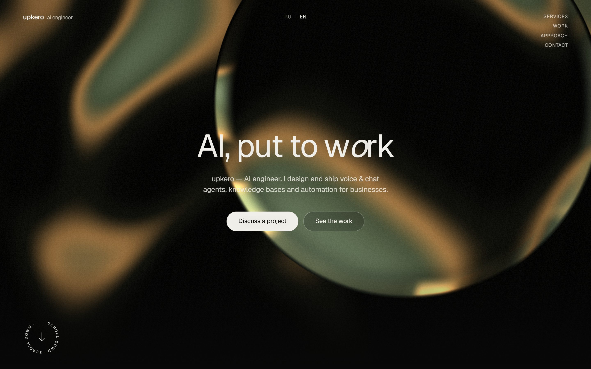

# portfolio-site

My portfolio site, in Russian and English. Every demo on it is the real thing: the chat,
the voice call and the agent console talk to the actual services through a small
server-side bridge, so nothing here is mocked or pre-recorded.



## What runs behind the demos

| Demo | Service |
|---|---|
| Voice call with Mila, who books a table | [voice-agent-service](https://github.com/upkero/voice-agent-service) |
| Sales chat from "hi" to a confirmed order | [sales-agent-service](https://github.com/upkero/sales-agent-service) |
| Questions answered from a knowledge base | [rag-chat-service](https://github.com/upkero/rag-chat-service) |
| An agent working through MCP tools, step by step | [mcp-ops-agent](https://github.com/upkero/mcp-ops-agent) |
| Raw API calls, including a double-booking attempt | [ops-core-api](https://github.com/upkero/ops-core-api) |

## How the bridge works

The browser never talks to a service directly. It calls `/live/<service>/<path>`, and
`server/live.js` forwards the request:

- only the routes the demos need are allowed, everything else is a 404;
- the API keys live in the server's environment and are added there, so none of them is
  in the JavaScript bundle;
- each visitor gets their own rate limit per demo (the services only see the bridge's
  address, so their own limits would be shared by everyone);
- bodies over 16 KB get a 413, and the agent's event stream is passed through as it
  arrives.

`server.mjs` serves the built site and mounts the bridge. In development, Vite mounts the
same bridge, so `npm run dev` behaves like production.

## Run it

You need the five services running (their READMEs cover that), then:

```bash
cp .env.example .env.local   # service URLs and the keys each one requires
npm ci
npm run dev                  # http://localhost:5173

npm run build && npm start   # production server on http://localhost:4173
npm test                     # bridge and server tests
```

A production image is included (`Dockerfile`): it builds the site and runs `server.mjs`.
Behind a reverse proxy, set `TRUST_PROXY=1` so the rate limit sees each visitor's address.

## Built with

Vite and plain JavaScript, a hand-written WebGL shader for the background, GSAP and Lenis
for motion, and the LiveKit client for the voice call. The shader is kept cheap on
purpose (it adapts its resolution and caps at 60 fps) so the page stays smooth on
integrated graphics.

## License

MIT
